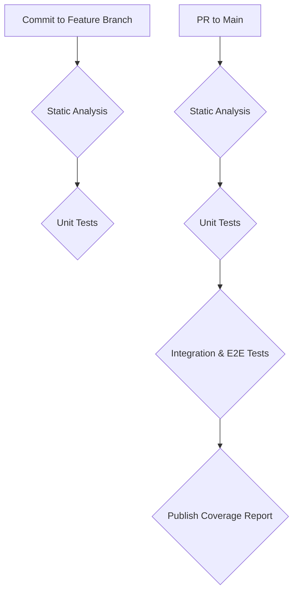

# Testing and Quality Assurance Strategy for macos-updatetool

This document outlines a comprehensive testing and quality assurance strategy for the `macos-updatetool`. The goal is to improve the tool's reliability, maintainability, and overall quality through a robust testing framework and a streamlined CI/CD pipeline.

## 1. Evaluation of Existing Test Suite

This section analyzes the current state of the `bats-core` test suite and the supplementary scripts found in the `_tests` directory.

### Strengths

- **Logical Test Structure:** The test suite is well-organized into `unit`, `integration`, `e2e`, `config`, and `completions` directories. This separation of concerns is a commendable practice, making it easier to locate and maintain tests related to specific functionalities.
- **NPM Script Integration:** The `package.json` file provides a clear and convenient way to run tests using `npm` scripts. The `test:all` command, which combines linting, config checks, and all test suites, is particularly useful for ensuring a comprehensive check.
- **Basic Coverage:** The existing tests provide a foundational level of coverage for the tool's primary commands and options, such as verifying that `help`, `version`, and `list` commands execute without errors.

### Weaknesses and Gaps

- **Insufficient Granularity in Unit Tests:** The current unit tests (`test/unit/test_cli.bats`) primarily test the CLI's surface-level behavior (e.g., argument parsing, help text). They do not test individual functions within the `macos-updatetool` script in isolation. This makes it difficult to pinpoint the exact source of a failure and leads to brittle tests that are highly dependent on the command's output format.
- **Lack of Mocking:** The tests make live calls to external dependencies like `brew`, `mas`, and `npm`. This makes the test suite slow, unreliable (due to network issues or external service outages), and non-deterministic. It also makes it impossible to test failure scenarios, such as how the tool behaves when a `brew` update fails.
- **Limited Assertions:** Many tests only assert that a command returns a status code of 0 and that the output contains a specific string. This is insufficient for verifying complex logic. For example, the E2E tests for `add` and `remove` only `grep` for the package name in the YAML file, without validating the file's structure or ensuring that no other unintended changes were made.
- **Unused and Ad-Hoc Tests:** The `_tests` directory contains numerous scripts (`check_serious.zsh`, `test_cask_fix.zsh`, etc.) that appear to be for one-off debugging or experimental purposes. These are not integrated into the automated test suite, meaning they are not run regularly and can quickly become outdated. This represents a missed opportunity to formalize valuable test cases.
- **No Code Coverage Metrics:** There is no mechanism in place to measure code coverage (line, function, or branch). This makes it difficult to identify which parts of the codebase are undertested and to track progress in improving test coverage over time.

## 2. Proposed Testing Enhancements

To address the weaknesses identified above, the following enhancements are proposed.

### 2.1. Unit Test Improvements

The key to improving the test suite is to refactor the tests to support true unit testing of individual shell functions. This requires a strategy for isolating functions from the rest of the script and mocking their dependencies.

**Strategy:**

1.  **Isolate Functions:** Source the main `macos-updatetool` script in the `test_helper.bash` file. This will make all its functions available for testing in any `bats` test file.
2.  **Mock External Commands:** Create mock versions of external commands (e.g., `brew`, `mas`, `npm`, `yq`) within the test environment. These mocks can be simple shell functions that assert they were called with the correct arguments and return predefined outputs. This will allow for testing function logic in isolation, without making slow and unreliable network calls.
3.  **Focus on Logic, Not Output:** Unit tests should validate the logic of a function, not its decorative output. For example, a test for the `manage_applist` function should assert that the `yq` command was called with the correct parameters, rather than checking the color of the success message.

**Example: Testing the `manage_applist` function**

Here is an example of how to test the `manage_applist` function in isolation, with a mocked `yq` command:

```bash
#!/usr/bin/env bats

load '../test_helper'

setup() {
  setup_test_env
  create_test_config

  # Mock the yq command
  yq() {
    echo "Mock yq called with: $@" >> "$BATS_TEST_TMPDIR/yq.log"
    # Simulate a successful write
    return 0
  }
  export -f yq
}

teardown() {
  teardown_test_env
}

@test "manage_applist add should call yq with correct arguments" {
  run manage_applist "add" "formulas" "git"
  [ "$status" -eq 0 ]

  # Assert that yq was called correctly
  run grep -q "'.brew_formulas += \[\"git\"\]'" "$BATS_TEST_TMPDIR/yq.log"
  [ "$status" -eq 0 ]
}
```

### 2.2. End-to-End (E2E) Test Strategy

E2E tests are essential for verifying that the tool works as expected from a user's perspective. These tests should cover critical user workflows and validate the tool's behavior in a production-like environment (albeit with mocked external services to ensure reliability).

**Critical User Workflows to Test:**

1.  **Initial Setup:**
    - **Scenario:** A new user runs the tool for the first time without a configuration file.
    - **Steps:**
      1.  Run `macos-updatetool list`.
      2.  The tool should detect that `applist.yaml` is missing and prompt the user to create one.
      3.  The user agrees, and the tool creates the default `applist.yaml`.
    - **Success Criteria:** The `applist.yaml` file is created with the correct default content and permissions.

2.  **Updating Applications:**
    - **Scenario:** A user runs `macos-updatetool all update`.
    - **Steps:**
      1.  The tool reads the `applist.yaml` file.
      2.  It calls the appropriate package managers (`brew`, `mas`, `npm`) to update the applications listed.
    - **Success Criteria:** The tool executes the update commands for all defined packages and reports a summary of the results. Mocked commands should confirm they were called.

3.  **Handling Failed Updates:**
    - **Scenario:** A `brew` update fails for a specific formula.
    - **Steps:**
      1.  The mock `brew` command is configured to return a non-zero exit code.
      2.  The user runs `macos-updatetool brew update`.
    - **Success Criteria:** The tool should gracefully handle the error, report the failure to the user, and continue with the remaining updates. The final exit code should reflect that a failure occurred.

4.  **Non-Interactive/CI Mode:**
    - **Scenario:** The tool is run in a non-interactive CI environment.
    - **Steps:**
      1.  Run `macos-updatetool all update` with the `--non-interactive` flag (a proposed new feature).
    - **Success Criteria:** The tool should not prompt for user input and should exit with a clear status code indicating success or failure.

## 3. CI/CD Integration Strategy

This section architects a CI/CD pipeline to automate testing, linting, and quality checks. The proposed pipeline will be triggered on pull requests to the `main` branch, providing fast feedback to developers.

**Pipeline Stages:**

1.  **Static Analysis (Linting):**
    - **Trigger:** On every commit to a feature branch.
    - **Action:** Run `shellcheck` to identify common shell scripting errors. This can be done using the existing `npm run lint` command.
    - **Benefit:** Catches syntax errors and potential bugs early in the development process.

2.  **Unit Tests:**
    - **Trigger:** On every commit to a feature branch.
    - **Action:** Run the unit test suite (`npm run test:unit`). This stage should use the mocking strategy outlined in the previous section to ensure fast and reliable execution.
    - **Benefit:** Provides rapid feedback on the correctness of individual functions.

3.  **Integration and E2E Tests:**
    - **Trigger:** On pull requests to the `main` branch.
    - **Action:** Run the full integration and E2E test suites (`npm run test:integration` and `npm run test:e2e`).
    - **Benefit:** Verifies that the different components of the tool work together as expected and that critical user workflows are not broken.

4.  **Code Coverage Reporting:**
    - **Trigger:** On pull requests to the `main` branch.
    - **Action:**
      1.  Instrument the `macos-updatetool` script for coverage analysis using a tool like `kcov`.
      2.  Run the full test suite (`npm run test:all`).
      3.  Publish the coverage report to the pull request (e.g., using Codecov or a similar service).
    - **Benefit:** Provides clear visibility into which parts of the codebase are not covered by tests, helping to guide future test-writing efforts.

**Mermaid Diagram of the CI/CD Pipeline:**



## 4. Workflow Command Improvements

To improve the developer experience and make the testing workflow more efficient, the following changes to the `package.json` scripts are recommended.

**Proposed `package.json` Scripts:**

```json
"scripts": {
  "install": "echo 'Setting up macos-updatetool...'",
  "postinstall": "echo 'macos-updatetool installed successfully! Run: macos-updatetool help'",
  "lint": "shellcheck -s bash ./bin/*",
  "lint:fix": "shellcheck -s bash -f diff ./bin/* | git apply",
  "test": "bats test/",
  "test:unit": "bats test/unit/",
  "test:integration": "bats test/integration/",
  "test:e2e": "bats test/e2e/",
  "test:config": "bats test/config/",
  "test:completions": "bats test/completions/",
  "test:all": "npm run lint && npm run test",
  "test:watch": "onchange 'bin/*' 'test/**/*.bats' -- npm run test",
  "coverage": "kcov --include-pattern=bin/macos-updatetool coverage-report npm run test:all",
  "dev:setup": "brew install shellcheck bats-core kcov onchange && npm install && chmod +x scripts/*.sh"
},
```

**Summary of Improvements:**

- **`test:all` Consolidation:** The `test:all` script is simplified to run `lint` and then all `bats` tests. The `config:check` can be absorbed into the `test:config` suite for better consistency.
- **`test:watch` for TDD:** A new `test:watch` script is introduced, using a tool like `onchange`. This will automatically re-run the test suite whenever a change is detected in the main script or any of the test files, facilitating a Test-Driven Development (TDD) workflow.
- **`coverage` Script:** A dedicated `coverage` script is added to generate a code coverage report using `kcov`. This makes it easy to measure test coverage locally.
- **`dev:setup` Enhancements:** The `dev:setup` script is updated to include all necessary development dependencies (`kcov`, `onchange`), ensuring a consistent and easy-to-set-up development environment.
